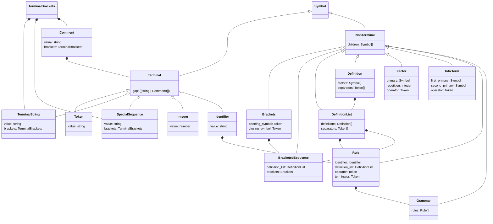

# EBNF Parser Library

The library implements a grammar rule parser in EBNF format, compliant with the standard __ISO/IEC 19477:1996__ [^1].

It is provided as an __ECMAScript 6__ module.

## Installation

### NPM package

The library can be installed using the following command:

```
npm install @liquescens/ebnf
```

This installation allows you to use the library with __type checking__ and __IntelliSense__ support. 

### Runtime Configuration

To ensure runtime code support on a web page, you need to configure JavaScript module import mapping.

You can use the version available via CDN for this purpose:

```html
<link rel="stylesheet" href="https://cdn.jsdelivr.net/npm/@liquescens/ebnf/default.css" />
<script type="importmap">
    {
        "imports":
        {
            "@liquescens/ebnf": "https://cdn.jsdelivr.net/npm/@liquescens/ebnf/index.js",
        }
    }
</script>
```

## Usage Examples

### Using the Default Configuration

The parser can be run with default settings, compliant with the __ISO/IEC 14977__ standard.

```javascript
import * as EBNF from '@liquescens/ebnf';
const grammar = EBNF.parse('...');
```

### Choosing a Predefined Configuration

It is possible to use one of several predefined parser configurations.

```javascript
import * as EBNF from '@liquescens/ebnf';

const grammar_text = '...';
const lexer_configuration = EBNF.LexerConfiguration.iso_14977();
const lexer = new EBNF.Lexer(grammar_text, lexer_configuration);
const grammar = new EBNF.Parser(lexer).parse();
```

### Conversion to DOM

The parser allows converting the resulting grammar structure to a __DOM__ object.

```javascript
const grammar = new EBNF.parse(grammar_text);
const dom = new EBNF.toDom(grammar);
document.body.appendChild(dom);
```

```javascript
const grammar = new EBNF.parse(grammar_text);
const dom = new EBNF.Utilities.DOMGenerator().generate(grammar);
document.body.appendChild(dom);
```

### Other Examples

More examples can be found in the [documentation pages](https://pawel-stepnowski.github.io/ebnf-docs/).

## Object Structure

The following diagram illustrates the object structure of the grammar generated by the parser. Colors distinguish:

- the base class for all symbols,
- classes of terminal symbols,
- classes of non-terminal symbols,
- helper classes.



[^1]: The official whitepaper describes the comment expression as having an internal grammatical structure. In this implementation, the comment structure is not parsed. The comment content is represented as a single literal. 
